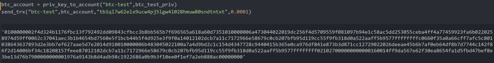

# Multi-Blockchain Wallet in Python


## Background

Your new startup is focusing on building a portfolio management system that supports not only traditional assets
like gold, silver, stocks, etc, but crypto-assets as well! The problem is, there are so many coins out there! It's
a good thing you understand how HD wallets work, since you'll need to build out a system that can create them.

You're in a race to get to the market. This project uses the php `hd-wallet-derive` library that supports not only BIP32, BIP39, and BIP44, but
also supports non-standard derivation paths for the most popular wallets.
This integrates the script into your backend with your dear old friend, Python.

Once you've integrated this "universal" wallet, you can begin to manage billions of addresses across 300+ coins, giving
you a serious edge against the competition.

This assignment,was to get two coins working: Ethereum and Bitcoin Testnet.

## Dependencies

- PHP must be installed on your operating system (any version, 5 or 7). Don't worry, you will *not* need to know any PHP.

-  [`hd-wallet-derive`](https://github.com/dan-da/hd-wallet-derive) tool. Available in the code but refer to documentation for installation

- [`bit`](https://ofek.github.io/bit/) Python Bitcoin library.

- [`web3.py`](https://github.com/ethereum/web3.py) Python Ethereum library.

- [`GoEthereum`](https://geth.ethereum.org/) Set up a custom PoA network (have used chain id as '8989')

## Description

The wallet is developed in python and can be used to send trancsaction on supported coin networks. The supported coins are provided in the [`constants`](wallet/constants.py) file.

To use the file open ['wallet'](wallet/wallet.py) in a python terminal.

The sequencing of callint the functions is as follows:

#### 1. Setup Accounts

This will set up the accounts and keys, based on the mnemonic phrase, for all the supported coins . This will also print the account details. It takes parameter - number of accounts- that is used to determine how many accounts shoud be generated

```
  keys = setup_accounts(3)
```

This will internally call the function derive_wallets which is a wrapper for the hd-wallet-derive php file 

```
def derive_wallets(mnemonic, coin, num_accounts) 
```
##### Output 


---

#### 2. Receive BTC-TEST

- To receive test btc, first select an address from your wallet
```
keys["btc-test"][0]['address']
```


- Copy the address and paste the address at a BTC Testnet Faucet like: [this testnet faucet](https://coinfaucet.eu/en/btc-testnet/).

- Use a [block explorer](https://tbtc.bitaps.com/) to validate transactions to the address.


---


#### 3. Send BTC-TEST
- To send BTC-TEST, first get the private key of the account

```
btc_test_priv = keys["btc-test"][0]['privkey']
```
- Get account from the private key using the commmand
```
btc_account = priv_key_to_account("btc-test",btc_test_priv)
```
- Send the BTC , using the command(the third parameter chould be replaced with the account you want to send to). You can also change the amount to send.
```
send_trx(coin="btc-test",account= btc_account,recipient="tb1ql7w62elx9ucw4pj5lgw4l028hmuw80sndtntxt",amount= 0.0001)
```
  This  function will internally call the create transaction function which creates the transaction and metadata required 
  ```
  def create_trx(coin, account, recipient, amount,chain_id)
  ```
Example





- Use a [block explorer](https://tbtc.bitaps.com/) to validate transactions to the address.


---

#### 4. Local PoA Ethereum transaction
- To send Ethereum on a local network, first select an Ethereum address from the derived accounts and ensure that is pre-funded on your network.

```
eth_addr = keys["eth"][0]['address']

```
- Get the private key of the account

```
eth_priv = ["eth"][0]['privkey']
```


-  Load the account based using the private key and coin type as eth
```
eth_account = priv_key_to_account("eth",eth_priv)
```
- Send the ETH , using the command(the third parameter chould be replaced with the account you want to send to)  You can also change the amount to send. The chain id is the network id of your local netowrk; refer to the network.json file of your network
```
send_trx(coin="eth",account=eth_account,recipient='0x73D167cF8bafAa2F21EC133B71c01E1e6e7AF01d",amount= 200,chain_id=8545)

```
  This  function will internally call the create transaction function which creates the transaction and metadata required 
  ```
  def create_trx(coin, account, recipient, amount,chain_id)
  ```

  Example

  

 - Validate the transaction number generated from the above command in MyWallet app
 
   


---
